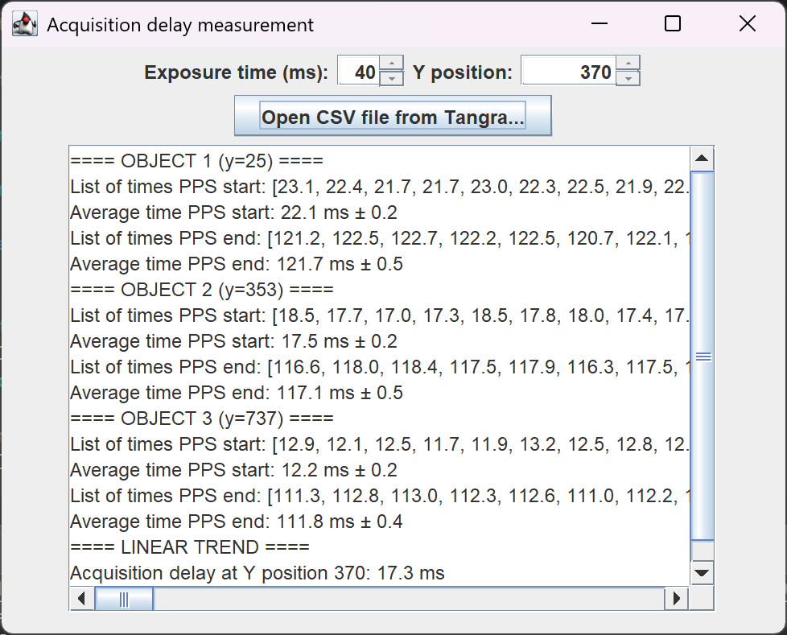
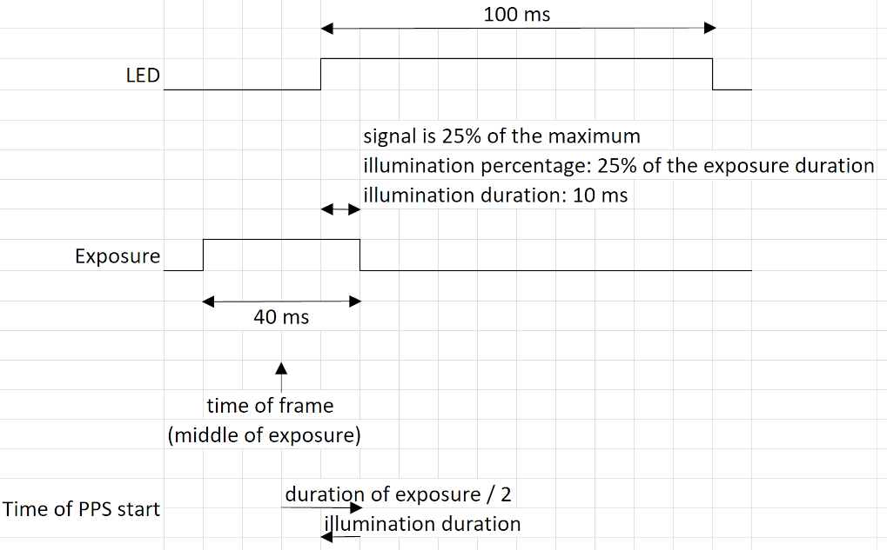

# Introduction

The goal of this program is to facilitate the measurement of the acquisition delay of a camera for astronomy usage.

For some astronomy usage (especially for occultations by asteroids), the requirement of time accuracy is very high (< 10 ms). If we use common CCD or CMOS camera, the operating system clocks must be set very precisely. The capturing software must accurately record the date and time. But it is not enough. We need to correct the date and time recorded with the delay between the moment when the light is captured by the sensor and the moment the capturing software records the data.

To know this difference, the principle is to film with the camera a LED that lights up each UTC second. The time recorded when the light is switched on is slightly offset from the start of the UTC second. This is what we want to measure. Amateur astronomers usually use Tangra software to analyse the video or the images. This program takes as input the Tangra light curve in CSV and give the acquisition delay.

# Requirement

- Java >= 8
- A CSV file representing a light curve (usually produced by Tangra) like this :

```
FrameNo,Time (UT),Signal (1), Background (1)
0,[02:47:20.867],33.000,22.000
1,[02:47:20.907],63.000,0.0000
```

Example files are given in the src/main/config folder.

This program assumes that the PPS LED lights up for 100 ms and the time is the middle of the exposure.

# Usage

## GUI (graphical user interface)

Download the JAR file and the run.bat (Windows) or run.sh (Linux) file.

To launch the program, double click on the JAR file.

If your system asks you which application to open the program with, choose Java.

If it doesn't work, click on the run.bat (Windows) or run.sh (Linux) file.

Or as a last resort use this command line (replace x.x.x by the version number):

```console
java -jar acquisition-delay-x.x.x.jar
```

A window opens. Choose your exposure time and select your CSV file.

The file is processed and the result appears:



## CLI (command line interface)

**The CLI is disabled** since version 0.0.2 (replaced by the GUI) but this documentation remains for memory.

By default, a file with the name **lightCurve.csv** is searched in the same directory as the jar file.

By default, we assume that the exposure of the frames is **40 ms**.

You can override these default values.

To launch the program, you can use these command lines:

```console
java -jar acquisition-delay.jar
```

or

```console
java -jar acquisition-delay.jar exposureDurationInMs
```

or

```console
java -jar acquisition-delay.jar exposureDurationInMs filename
```

Examples:

```console
java -jar acquisition-delay.jar
```

or

```console
java -jar acquisition-delay.jar 30
```

or

```console
java -jar acquisition-delay.jar 30 myLightCurve.csv
```

The result is shown in the console, like this :

```console
==== AREA 1 ====
List of times PPS start: [35.9, 36.7, 37.6, 37.9, 37.6, 37.5, 38.4, 37.0, 36.8, 36.5, 37.2]
Average time PPS start: 37.2 ms ± 0.4
List of times PPS end: [137.3, 137.1, 136.0, 136.8, 135.5, 135.5, 135.2, 136.1, 134.8, 136.7]
Average time PPS end: 136.1 ms ± 0.7
```

The program can measure several areas (like top, middle and bottom of the sensor).

# Building / compiling

If you want to build/compile this program by your own, you need Maven and JDK >= 8.

Use this command:

```console
mvn clean package
```

The resulting JAR file is stored in the target/ folder.

# About the calculation

Only the time and the signal columns of the CSV are used.

We assume that the LED is on for 100 ms and the exposure is less than 100 ms.

The algorithm determines the minimum and maximum signal in the series.

The minimum occurs when the LED is off during the whole exposure.

The maximum occurs when the LED is on during the whole exposure.

Intermediate values occur when the LED is on for part of the exposure time. We consider only values that are 10% above minimum and 10% under maximum.

If the signal is greater than the signal of the previous frame, we consider that the LED lights up during the exposure.

Illumination percentage is (signal - minimum signal) / (maximum signal - minimum signal).

Illumination duration is (duration of exposure * illumination percentage).

Time of PPS start = Time of the frame (middle of the exposure) + (duration of exposure / 2) - (illumination duration)

Example:



If the signal is less than the signal of the previous frame, we consider that the LED turns off during the exposure.

Time of PPS end = Time of the frame (middle of the exposure) - (duration of exposure / 2) + (duration of exposure * illumination percentage)
